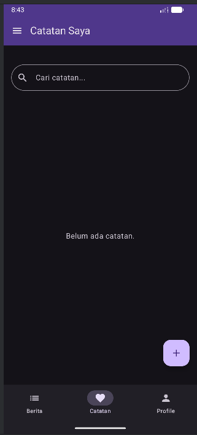
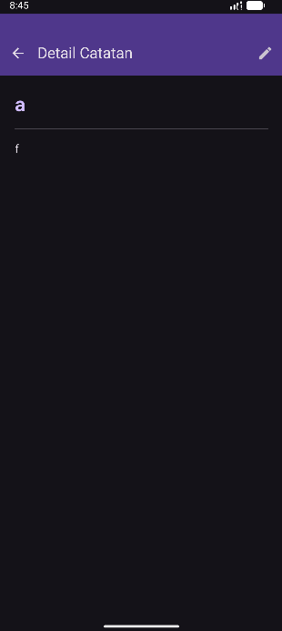
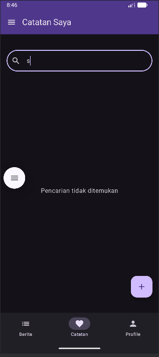
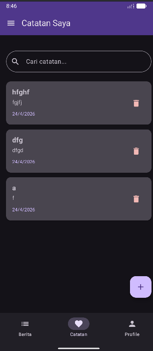
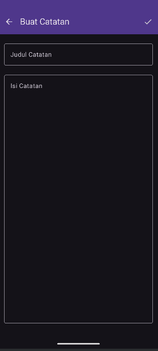
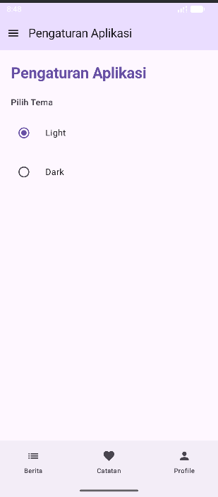

* **Nama:** Adi Septriansyah
* **NIM:** 123140021
* **Mata Kuliah:** Pengembangan Aplikasi Mobile (IF25-22017)
* **Instansi:** Institut Teknologi Sumatera (ITERA)

Tugas ini dikembangkan untuk memenuhi kriteria **Tugas Praktikum Minggu 7 - Pengembangan Aplikasi Mobile**.

---

##  Skema Database 

Aplikasi menggunakan skema database SQLite yang dikelola melalui SQLDelight. Berikut adalah struktur tabel utama:

**Tabel: `Note`**
| Nama Kolom | Tipe Data | Keterangan |
| :--- | :--- | :--- |
| `id` | `INTEGER` | *Primary Key* (Autoincrement) |
| `title` | `TEXT` | Judul catatan (*Required*) |
| `content` | `TEXT` | Isi konten catatan (*Required*) |
| `created_at` | `INTEGER` | *Timestamp* pembuatan dalam format milidetik |

**Query Utama (`Note.sq`):**
* **Select All:** `SELECT * FROM Note ORDER BY created_at DESC;`
* **Search:** `SELECT * FROM Note WHERE title LIKE ? OR content LIKE ?;`

---

## Interface


| Daftar Catatan & Empty State | Mode View & Form Catatan | Pencarian & Pengaturan |
| :---: | :---: | :---: |
|  |  |  |
|  |  |  |

---

## Video Demo


---

## 📁 Struktur Proyek
```text
composeApp/src/commonMain/kotlin/com/example/myfirstkmpapp/
├── datastore/      # Pengaturan Tema (SettingsManager)
├── db/             # Konfigurasi Database Driver
├── repository/     # Logika CRUD & Search
├── screens/        # UI (List, Detail, AddEdit, Settings)
├── viewmodel/      # State Management (Notes & Settings)
└── App.kt          # Navigasi & Theme Wrapper